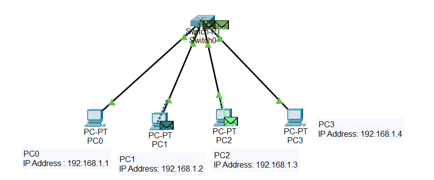

  

Part-1 membahas "Pengenalan LAN dasar"

Memperkenalkan dan menggunakan :

- Switch-PT
- PC
- Kabel UTP

Dan juga belajar memberikan Ip Address pada setiap PC dengan subnet mask /24 dengan host .1
Dengan penjealasan sebagai berikut :

- PC0 : 192.168.1.1
- PC1 : 192.168.1.2
  = PC2 : 192.168.1.3
- PC3 : 192.168.1.4

dengan subnet mask 255.255.255.0

Lalu setelah menyetting ip address pada setiap pc, melanjutkan dengan meng-testing di command prompt di cisco packet tracer dengan keyword "ping ${nama_ip_tujuan}"
