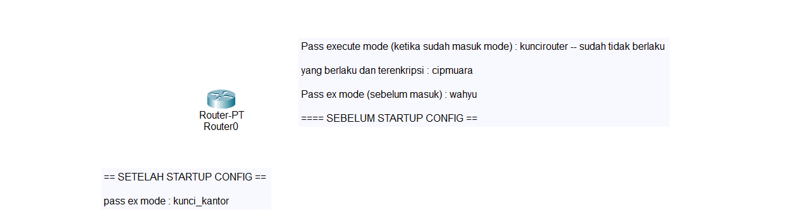

BELAJAR CISCO ROUTER DASAR

<p align="center">
  
</p>

Alat yang kita gunakan ada router-PT

Di episode kali ini, kita mulai dengan

## Melihat bagaiaman sistemasi booting router

kita bisa melihat dengan masuk ke `mode 'pyshical'` lalu matikan power dan tunggu 3 detik-an lalu nyalakan lagi, setelah seperi ini, kamu kembali ke `CLI (Command Line Interface)` dan kamu akan melihat proses booting router

Lalu ada pertanyaan :

```bash
"Would you like to enter the initial configuration dialog? [yes / no] : "
```

bisa dijawab dengnan `'no'` setelah itu kamu bisa tekan enter

Lalu kamu bisa masuk ke `mode 'excute mode'`. Ada beberapa mode di router :

```bash
- Pertama, mode "Execute Mode" ditandai dengan tanda > || contoh nya --> Router>
- Kedua, setelah itu, kamu bisa ke mode "Privillage mode", dengan menuliskan --> enable ditandai dengan --> Router#
- Ketiga, mode "Global mode" dengan cara --> configure terminal || lalu ditandai dengan Router(config)#
```

Lalu ada beberapa keyword baru, yaitu :

```bash
1. hostname nama_router = untuk memberikan nama host
2. enable password kunci_pass = untuk membuat password
3. line console 0 = untuk membuat password untuk memporteksi execute mode setelah masuk ke mode config-line, maka bisa membuat password nya dengan cara mengetikkan password ... lalu enter dan mengaktifkannya dengan login
4. show running-config = untuk melihat password nya
5. enable secret /{pass}\ = untuk membuat password yang terenkripsi --> command ini bisa menggantikan pass yang tidak terenkripsi (password yang dibuat dari command enable password)
6. banner motd &/{masukkan teks nya}\& = untuk membuat kalimat yang ada di halaman login
```

Jika kita mematikan power dan menyalakannya lagi maka config yang dibuat akan hilang.
Maka dari itu, kita akan menggunakan command :

```bash
- copy running-config startup-config
  setelah itu bisa di enter saja, dan jika ingin melihat nya, bisa :
- show startup-config
```
