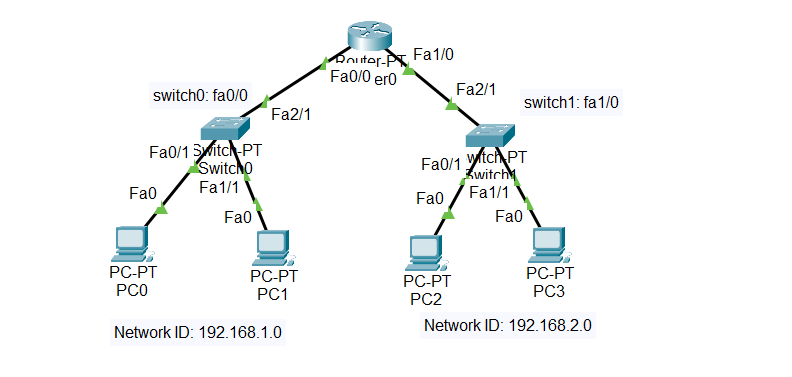

## PART 3 Menggabungkan router dan switch

Menjadikan router sebagai jembatan antara 2 PC yang network id nya berbeda

  

Materi pada part 3 kali ini adalah :

1. Menggabungkan pc yang network id nya berbeda, jika dalam gambar Network ID nya : 192.168.1.0 dan 192.168.2.0
2. Menyambungkan router dengan switch agar pc pada tiap tiap switch menyambung dengan router, pada contoh kabel LAN yang tersambung pada router dihubungkan ke port fa0/0 untuk switch0 dan fa 1/0 untuk switch1, dengan menggunakan command `interface fa0/0` -> untuk menyambungkan ke switch0 | disesuaikan dengan ip address pada pc
3. Setelah menghubungkan dengan command sebelumnya, membuat alamat gateway nya dengan mengetik `ip address 192.168.1.254` -> untuk switch0 | sesuaikan, lalu mengaktifkan dengan command `no shutdown`

Lakukan config tersebut di mode `router(config)#`

Setelah ini, bisa testing lewat pc maupun router, jika lewat router, maka masuk ke mode `router#`
